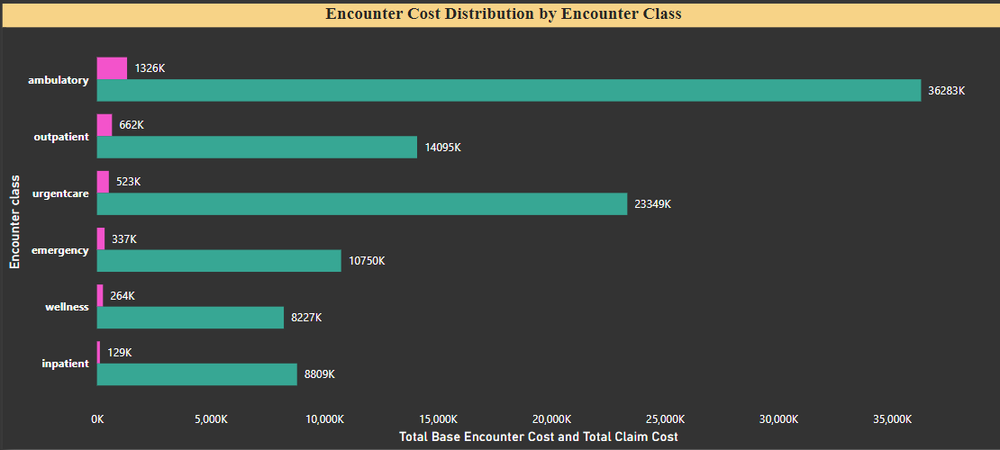
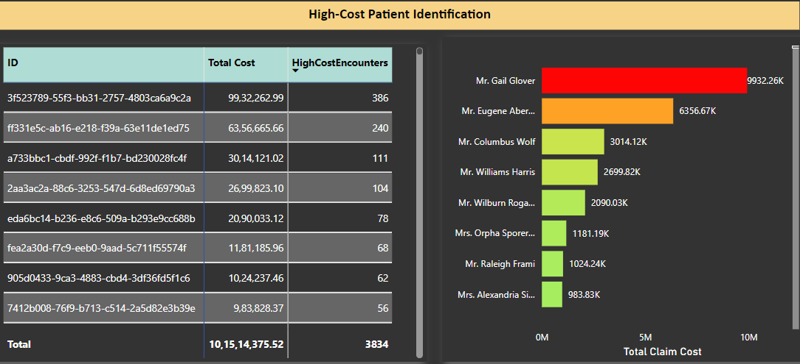
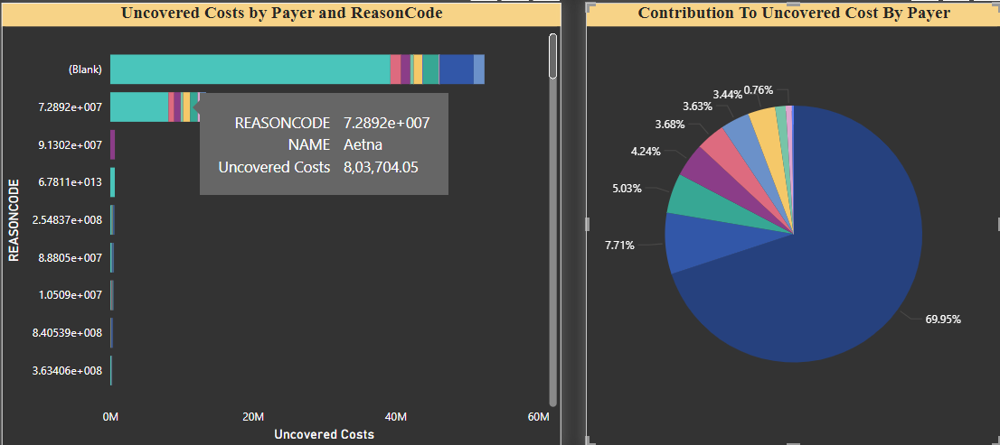
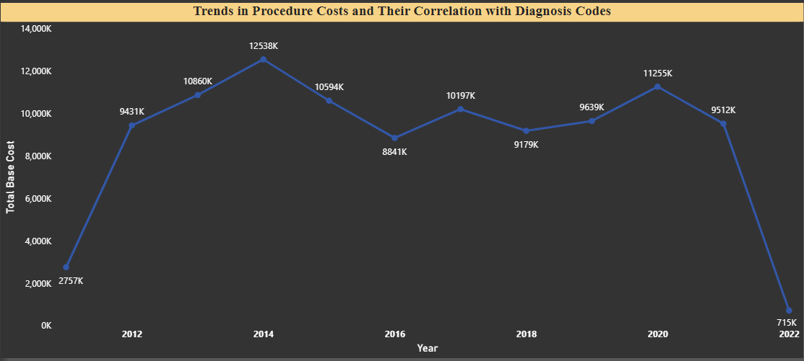

# 🏥 Patient Encounter Cost and Risk Analysis in Healthcare Systems

## 📊 Project Overview

This project focuses on identifying patients with frequent high-cost encounters, analyzing procedure costs, and evaluating financial risks due to payer coverage gaps. Leveraging SQL-based analysis and Power BI visualizations, the project aims to uncover insights to improve operational efficiency, patient care, and resource planning in healthcare organizations.

## 🔍 Problem Statement

Healthcare organizations face challenges in managing financial risks and costs due to:

1. Frequent High-Cost Encounters
2. Uncovered Costs by Payer Coverage
3. Trends in Procedure Costs and Diagnosis Correlations

The analysis uses SQL to identify patterns across 5 key tables:

* Encounters
* Patients
* Procedures
* Payers
* Organizations

## ⚙️ Tools & Technologies Used

* SQL: Data cleaning, querying, and analysis.
* Power BI: Interactive visualizations and dashboards.

## 🗂️ Dataset Description

* Encounters: Details of patient visits, cost, class, and duration.
* Patients: Demographic details of patients.
* Procedures: Information on procedures performed during encounters.
* Payers: Payer contributions and coverage gaps.
* Organizations: Geographical and organizational-level data.

## 🛠️ Data Preparation (Cleaning and Loading)
The data preparation phase involved creating tables, loading data from CSV files, and cleaning fields to ensure data consistency.
### 1. Database and Table Creation
* A new database named COST_AND_RISK_ENCOUNTER was created.
* Tables created:

  * **Encounters:** Stores patient encounter details including costs, codes, and descriptions.
  * **Organizations:** Contains information about healthcare organizations, locations, and addresses.
  * **Patients:** Includes patient demographics like gender, race, birthdate, and location.
  * **Procedures:** Captures information about medical procedures performed during encounters.
  * **Payers:** Contains details about payers and their coverage contributions.

**Example Table Schema** (for Encounters):
```sql
CREATE TABLE Encounters (
    ENCOUNTER_Id VARCHAR(MAX),
    START Datetime,
    STOP Datetime,
    PATIENT VARCHAR(MAX),
    ORGANIZATION VARCHAR(MAX),
    PAYER VARCHAR(MAX),
    ENCOUNTERCLASS VARCHAR(MAX),
    CODE VARCHAR(MAX),
    DESCRIPTION VARCHAR(MAX),
    BASE_ENCOUNTER_COST FLOAT,
    TOTAL_CLAIM_COST FLOAT,
    PAYER_COVERAGE FLOAT,
    REASONCODE FLOAT,
    REASONDESCRIPTION VARCHAR(MAX)
);
```

### 2. Data Loading
* Data was loaded into the tables using BULK INSERT from CSV files.
* Example:
```sql
BULK INSERT Encounters  
FROM 'C:\\Users\\getla\\OneDrive\\Desktop\\Dataset\\encounters.csv'  
WITH (Fieldterminator = ',', Rowterminator = '\n', Firstrow = 2);
```
### 3. Data Cleaning
Cleaned the FIRST field in the Patients table to remove unnecessary characters:
```SQL
UPDATE Patients
SET FIRST = REPLACE(REPLACE(REPLACE(REPLACE(REPLACE(
           REPLACE(REPLACE(REPLACE(REPLACE(REPLACE(First, '0', ''), '1', ''), '2', ''), '3', ''), '4', ''), '5', ''), '6', ''), '7', ''), '8', ''), '9', '')
WHERE First IS NOT NULL AND FIRST LIKE '%[0-9]%';

```


## 📈 Steps of Analysis
### 1. SQL Analysis

The following SQL queries were used to analyze patient encounter costs, financial risks, and procedure trends:

#### 1.1 Evaluating Financial Risk by Encounter Outcome
- **Objective**: This query identifies the ReasonCodes that lead to the highest financial risk by calculating the uncovered cost (total claim cost minus payer coverage) for each encounter outcome.
- **Explanation**:
  	* The query combines patient demographics with encounter details to compute the uncovered cost for each encounter.
  	* It then aggregates the data to calculate the average uncovered cost, total uncovered cost, and the number of encounters for each ReasonCode and EncounterOutcome.
- [View the SQL Query](SQL/Financial_Risk_Encounter_Outcome.sql)


#### 1.2 Identifying Patients with Frequent High-Cost Encounters
- **Objective**: This query identifies patients who had **more than 3 encounters** in a year, where each encounter had a **total claim cost above $10,000.**
- **Explanation:**
	* A CTE (HighCostEncounters) is used to calculate the total number of encounters and the sum of claim costs for each patient grouped by year.
 	* The query filters for patients whose **total encounters exceed 3** and sorts them by the number of encounters and total claim costs in descending order.
- [View the SQL Query](SQL/High_Cost_Encounters.sql)

#### 1.3 Identifying Risk Factors Based on Demographics
- **Objective:** This query identifies the top 3 most frequent diagnosis codes (ReasonCodes) and analyzes their association with patient demographics such as gender, race, and ethnicity to understand which groups are most affected by high-cost encounters.
- **Explanation:**
	* The query first determines the **top 3 ReasonCodes** with the most encounters.
	* It then calculates the **average uncovered cost, total uncovered cost** and **number of encounters** for each group segmented by gender, race, and ethnicity.
- [View the SQL Query](SQL/RiskFactors_on_Demographics_Encounter.sql)


#### 1.4 Analyzing Payer Contributions for Procedure Costs
- **Objective**: This query analyzes **payer contributions** for the base cost of procedures and identifies any **gaps** between the **total claim cost** and the **payer coverage**.
- **Explanation:**
	* The query calculates the **total base cost**, **total claim cost** and **total payer coverage** for each procedure (ProcedureCode and ProcedureDescription) grouped by PAYER.
	* It also computes the **uncovered cost** as the difference between total claim cost and total payer coverage.
	* The results are ordered by the **highest uncovered costs** to highlight significant financial gaps.
- [View the SQL Query](SQL/Payer_Contributions_for_Procedure.sql)

#### 1.5 Analyzing Patient Encounter Duration
 - **Objective**: This query calculates the **average encounter duration** for each EncounterClass per organization, identifying encounters where the duration exceeds **24 hours**.
 - **Explanation**:
	* The query calculates the duration of each encounter in hours by subtracting the START time from the STOP time.
	* It then calculates the **average duration** for each EncounterClass within each organization and counts the number of encounters that exceed **24 hours**.
 - [View the SQL Query](SQL/Encounter_Duration.sql)


#### 1.6 Identifying Patients with Multiple Procedures Across Encounters
- **Objective**: This query identifies patients who had **multiple procedures across different encounters** with the same ReasonCode.
- **Explanation**:
	* The query first calculates the distinct encounters and distinct procedures for each patient and ReasonCode.
	* It then filters the results to only include patients with more than one encounter (DistinctEncounters > 1), ensuring that the analysis focuses on repeated high-cost utilization patterns.
	* Finally, the patient details such as FIRST, LAST, GENDER, and BIRTHDATE are retrieved and the results are ordered by encounter frequency and total procedures.
- [View the SQL Query](SQL/Multiple_Procedures_Encounters.sql)


### 2.Power BI Visualizations
**1. Encounter Cost Distribution by Encounter Class**



**2. High-Cost Patient Identification**



**3. Uncovered Costs by Payer and Reason Code**



**4. Procedure Cost Trends**




## 🔑 Key Insights  
1.**High-Cost Encounters:**
Patients with frequent high-cost visits significantly contribute to the total expenses, requiring targeted care management.

2.**Payer Coverage Gaps:**
Uncovered costs are highest for certain ReasonCodes and procedure types, indicating areas for improved payer negotiations.

## 🚀 How to Run the Project
1. Clone this repository:
   git clone https://github.com/itssachinjadhav/Patient-Cost-Risk-Analysis.git
2. Run the SQL scripts in your SQL environment.
3. Open the Power BI .pbix file to explore interactive dashboards.

## 🎯 Conclusion
This project provides actionable insights for healthcare organizations to identify cost trends, optimize resource allocation, and manage financial risks effectively.


  
